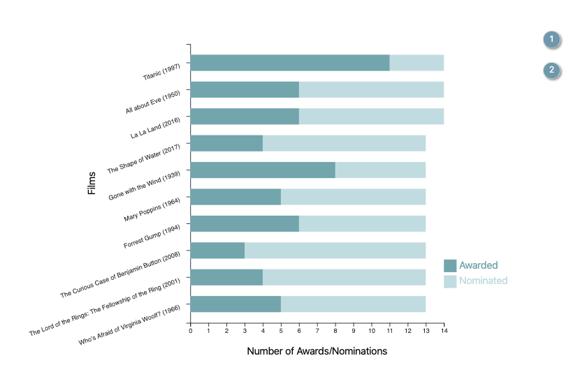
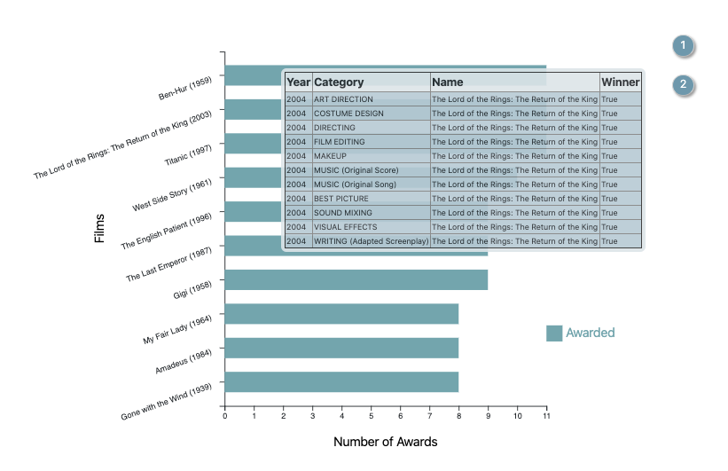

Hello! Writing today's blog post is a brand new experience for me. This is a step-by-step tutorial on how to implement a D3 visualisation based on the Oscar Awards Dataset. The dataset comprises of ~ 10,400 data points, comprising of Oscar awards data from 1927 to 2020.




> The application will allow transitions between 2 visualisations (Barcharts).

> The dataset: https://www.kaggle.com/unanimad/the-oscar-award
> 
> The visualisation: https://bryantkhoo.github.io/oscar-vis/
> 
> Code for this visualisation: https://github.com/bryantkhoo/oscar-vis

Pre-requisites to run the visualisation: d3 and react

To run the visualisation, you can simply clone the git repository. Preprocessing of the dataset has been done to get the essential parts of the dataset for this visualisation. The relevant jupyter notebook can be found at the ./notebooks directory of the git repo. All the dependencies can be found in the package.json file in the main directory. With npm already installed on your PC you can just run to get all the dependencies installed:
```bash{promptUser: bryantkhoo}
npm install
```

Once you have all the dependencies installed, simply run the following to get a development build deployed on your localhost:
```bash{promptUser: bryantkhoo}
npm run develop
```

Now that we have the visualisation up and running lets dive deeper into the inner working of the application. D3 is quite a lowlevel library, so it might be a good idea to be patient and read through the code slowly! The application is a simple react application that uses create-react-app as a scaffold. The main approach used to implement d3 in a react app is via lifecycle methods wrapping. You can read more about this from the following URL: 

https://www.smashingmagazine.com/2018/02/react-d3-ecosystem/

To get the visualisation up and running, we need to make the following changes to the src/App.js file
```javascript{numberLines: 1}
// src/App.js
import React, { Component } from "react";
import ChartWrapper from "./ChartWrapper";

class App extends Component {
  state = {
    topic: 1
  };

  toggleNomineeAwards = topic => this.setState({ topic });
  

  render() {
    return (
      <div className="App">
        <div className="row">
          <div className="col-xs-offset-1 col-xs-6">
            <hr></hr>
          </div>
        </div>
        <div className="article">
          <div className="row">
            <div className="col-xs-offset-1 col-xs-9">
              <ChartWrapper
                className="vis-center-container"
                topic={this.state.topic}
              />
            </div>
            <div className="col-xs-2">
              <div className="row">
                <button
                  className="float"
                  onClick={() => this.toggleNomineeAwards(1)}
                >
                  1
                </button>
              </div>
              <div className="row">
                <button
                  className="float"
                  onClick={() => this.toggleNomineeAwards(2)}
                >
                  2
                </button>
              </div>
            </div>
          </div>
        </div>
      </div>
    );
  }
}

export default App;

```

* The App.js will render 2 main parts, the main chart component and the buttons to toggle the transition between visualisations.
* The react application manages the topic state, which triggers a re-render of the chart whenever the the relevant button is clicked.

Next, we loook at the ChartWrapper.js file that acts as a Wrapper component to contain our D3 charts. As you can see, topic is passed down as props to the wrapper component, which will re-render the new D3 chart.
```javascript{numberLines: 1}
// src/ChartWrapper.js
import React, { Component } from 'react';
import D3Chart from './D3Chart';

export default class ChartWrapper extends Component {
	componentDidMount() {
		this.setState({
			chart: new D3Chart(this.refs.chart)
		})
	}

	shouldComponentUpdate() {
		return false
	}

	componentWillReceiveProps(nextProps) {
		this.state.chart.update(nextProps.topic)
	}
	
	render() {
		return <div ref="chart"></div>
	}
}
```

In the D3Chart.js file, we first need to import the relevant d3 library and datafiles for the visualisation. For convenience, I have placed the datafiles in the ./datasets directory.

```javascript{numberLines: 1}
import * as d3 from "d3";
import nominated_films_data from "./datasets/nominated_films.csv";
import awarded_films_data from "./datasets/awarded_only_films.csv";
import awarded_details_data from "./datasets/top_10_awarded.csv";
import nominated_details_data from "./datasets/top_10_nominated.csv";
```

Next, we define the margins, width and height for the svg element.

```javascript{numberLines: 7}
const MARGIN = { TOP: 10, BOTTOM: 50, LEFT: 300, RIGHT: 100 };
const WIDTH = 800 - MARGIN.LEFT - MARGIN.RIGHT;
const HEIGHT = 500 - MARGIN.TOP - MARGIN.BOTTOM;
```

We then definte the following class structure for our D3 chart.
```javascript{numberLines: 11}
export default class D3Chart {
    constructor(element) {
        // Constructor code here
    }
    update(topic) {
        // Update code here
    }
}
```


Within the constructor, we then do the following:
* Initialize the svg element and its attributes
* Initialize the tooltip element, which will appear when we eventually hover our mouse over the rect elements of the bar chart
* Intialize the x and y axis labels, and their axisGroups
* Load in the necessary data sets using the d3.csv() api
* call the update() function

```javascript{numberLines: 12}
  constructor(element) {
    const vis = this;

    vis.svg = d3
      .select(element)
      .append("svg")
      //.attr("width", WIDTH + MARGIN.LEFT + MARGIN.RIGHT)
      //.attr("height", HEIGHT + MARGIN.TOP + MARGIN.BOTTOM)
      .attr("preserveAspectRatio", "xMinYMin meet")
      .attr("viewBox", `0 0 800 500`)
      .classed("svg-content-responsive", true)
      .append("g")
      .attr("transform", `translate(${MARGIN.LEFT}, ${MARGIN.TOP})`);

    vis.tooltip = d3
      .select("body")
      .append("div")
      .attr("class", "tooltip")
      .style("opacity", 0);

    vis.xLabel = vis.svg
      .append("text")
      .attr("x", WIDTH / 2)
      .attr("y", HEIGHT + 50)
      .attr("text-anchor", "middle");

    vis.yLabel = vis.svg
      .append("text")
      .attr("x", -(HEIGHT / 2))
      .attr("y", -50)
      .attr("text-anchor", "middle")
      .attr("transform", "rotate(-90)");

    vis.xAxisGroup = vis.svg
      .append("g")
      .attr("transform", `translate(0, ${HEIGHT})`);

    vis.yAxisGroup = vis.svg.append("g");

    d3.csv(nominated_films_data).then(function(dataset) {
      dataset = dataset.slice(0, 10);
      console.log(dataset);
      dataset.forEach(function(d) {
        d.nominated = +d.nominated;
        d.won = +d.won;
      });
      vis.nomineeData = dataset;
      vis.update(1);
    });

    d3.csv(awarded_films_data).then(function(dataset) {
      dataset = dataset.slice(0, 10);
      console.log(dataset);
      dataset.forEach(function(d) {
        d.won = +d.won;
      });
      vis.awardeeData = dataset;
    });

    d3.csv(awarded_details_data).then(function(dataset) {
      console.log(dataset);
      dataset.forEach(function(d) {
        d.won = +d.won;
      });
      vis.awardedDetailsData = dataset;
    });

    d3.csv(nominated_details_data).then(function(dataset) {
      console.log(dataset);
      dataset.forEach(function(d) {
        d.won = +d.won;
      });
      vis.nominatedDetailsData = dataset;
    });
}
```

The update function then calls the D3 exit(), update(), enter() apis to create the necessary elements on the DOM. The if construct within the update() function determines which vis is rendered in the end.

We do the following to generate a particular vis.
1. Specify the X and Y Axis labels, and the necessary transformations.
2. Generate the scales for the x and y axis using scaleLinear an scaleBand respectively. ScaleBand is used for our y axis ticks because the film names are categorical.
3. We then do the data join (exit, update and enter) for the rectangles of the barcharts. Seperate groups of rectangles are intialized for the awarded (winner) and nominated counts.
4. "mousemove", "mouseover" and "mouseout" events are then declared for the relevant rectangles to create our tooltips which hover over the barcharts when you mouse over them.
5. Lastly, we generate the keys and labels needed for the legend in the visualisation

The above steps are done for visualisations for topic 1 and topic 2.
```javascript{numberLines: 88}
 update(topic) {
    const vis = this;

    if (topic === 1) {
      vis.data = vis.nomineeData;
      vis.xLabel.text(`Number of Awards/Nominations`);
      vis.yLabel
        .text(`Films`)
        .transition()
        .duration(500)
        .attr("y", -150);

      // update the axis scales for transition
      const x = d3
        .scaleLinear()
        .domain([0, d3.max(vis.data, d => d.nominated)])
        .range([0, WIDTH]);

      const y = d3
        .scaleBand()
        .domain(vis.data.map(d => d.film))
        .range([0, HEIGHT])
        .padding(0.4);

      const xAxisCall = d3.axisBottom(x);
      vis.xAxisGroup
        .attr("transform", `translate(0,${HEIGHT})`)
        .transition()
        .duration(500)
        .call(xAxisCall);

	  const yAxisCall = d3.axisLeft(y)
		  .ticks(8);
		  
      vis.yAxisGroup
        .transition()
        .duration(500)
        .call(yAxisCall)
		.selectAll("text")
		.style("text-anchor", "end")
        .attr("dx", "-.8em")
        .attr("dy", ".15em")
		.attr("transform", "rotate(-20)");

      // DATA JOIN
      const rectsNominated = vis.svg.selectAll("rect.nomRect")
        .data(vis.data);

      // EXIT
      rectsNominated
        .exit()
        .transition()
        .duration(500)
        .attr("height", 0)
        .attr("width", 0)
        .remove();

      // UPDATE
      rectsNominated
        .transition()
        .duration(500)
        .attr("class", "nomRect")
        .attr("x", 0)
        .attr("y", d => y(d.film))
        .attr("height", y.bandwidth)
        .attr("width", d => x(d.nominated))
        .attr("fill", "#c3dce0");

      // ENTER
      rectsNominated
        .enter()
        .append("rect")
        .transition()
        .duration(500)
        .attr("class", "nomRect")
        .attr("x", 0)
        .attr("width", d => x(d.nominated))
        .attr("y", d => y(d.film))
        .attr("height", y.bandwidth)
        .attr("fill", "#c3dce0");

      // DATA JOIN
      const rectsWon = vis.svg.selectAll("rect.oscarRect")
        .data(vis.data);

      // EXIT
      rectsWon
        .exit()
        .transition()
        .duration(500)
        .attr("height", 0)
        .attr("width", 0)
        .remove();

      // UPDATE
      rectsWon
        .transition()
        .duration(500)
        .attr("class", "oscarRect")
        .attr("x", 0)
        .attr("y", d => y(d.film))
        .attr("height", y.bandwidth)
        .attr("width", d => x(d.won))
        .attr("fill", "#78a5ad");

      // ENTER
      rectsWon
        .enter()
        .append("rect")
        .transition()
        .duration(500)
        .attr("class", "oscarRect")
        .attr("x", 0)
        .attr("width", d => x(d.won))
        .attr("y", d => y(d.film))
        .attr("height", y.bandwidth)
        .attr("fill", "#78a5ad");

      const rects = vis.svg.selectAll("rect");
      rects
        .on("mousemove", function(event) {
          vis.tooltip
            .style("top", d3.event.pageY - 51 + "px")
            .style("left", d3.event.pageX - 51 + "px");
        })
        .on("mouseover", function(d) {
          if (!d.nominated) {
            return;
          }
          vis.tooltip
            .transition()
            .duration(200)
            .style("opacity", 0.9);
          vis.tooltip
            .html(vis.getDetailsInTable(vis.nominatedDetailsData, 
                                        d.film))
            .style("left", d3.event.pageX + "px")
            .style("top", d3.event.pageY - 28 + "px");
        })
        .on("mouseout", function(d) {
          vis.tooltip.transition().style("opacity", 0);
        });

      vis.svg.selectAll(".mydots").remove();
      vis.svg.selectAll(".mylabels").remove();

      // create a list of keys
      let keys = ["Awarded", "Nominated"];

      // Usually you have a color scale in your chart already
      let color = d3
        .scaleOrdinal()
        .domain(keys)
        .range(["#78a5ad", "#c3dce0"]);

      // Add one dot in the legend for each name.
      let size = 20;
      vis.svg
        .selectAll("mydots")
        .data(keys)
        .enter()
        .append("rect")
        .attr("class", "mydots")
        .attr("x", WIDTH)
        .attr("y", function(d, i) {
          return HEIGHT - 100 + i * (size + 5);
        })
        .attr("width", size)
        .attr("height", size)
        .style("fill", function(d) {
          return color(d);
        });

      // Add one dot in the legend for each name.
      vis.svg
        .selectAll("mylabels")
        .data(keys)
        .enter()
        .append("text")
        .attr("class", "mylabels")
        .attr("x", WIDTH + size * 1.2)
        .attr("y", function(d, i) {
          return HEIGHT - 100 + i * (size + 5) + size / 2;
        })
        .style("fill", function(d) {
          return color(d);
        })
        .text(function(d) {
          return d;
        })
        .attr("text-anchor", "left")
        .style("alignment-baseline", "middle");
    } else if (topic === 2) {
      vis.data = vis.awardeeData;
      vis.xLabel.text(`Number of Awards`);
      vis.yLabel
        .text(`Films`)
        .transition()
        .duration(500)
        .attr("y", -150);

      // update the axis scales for transition
      const x = d3
        .scaleLinear()
        .domain([0, d3.max(vis.data, d => d.won)])
        .range([0, WIDTH]);

      const y = d3
        .scaleBand()
        .domain(vis.data.map(d => d.film))
        .range([0, HEIGHT])
        .padding(0.4);

      const xAxisCall = d3.axisBottom(x);
      vis.xAxisGroup
        .attr("transform", `translate(0,${HEIGHT})`)
        .transition()
        .duration(500)
        .call(xAxisCall);

	  const yAxisCall = d3.axisLeft(y)
		  .ticks(8);
		  
      vis.yAxisGroup
        .transition()
        .duration(500)
        .call(yAxisCall)
        .selectAll("text")
        .style("text-anchor", "end")
        .attr("dx", "-.8em")
        .attr("dy", ".15em")
		.attr("transform", "rotate(-20)");

      // DATA JOIN
      const rectsWon = vis.svg.selectAll("rect").data(vis.data);

      // EXIT
      rectsWon
        .exit()
        .transition()
        .duration(500)
        .attr("height", 0)
        .attr("width", 0)
        .remove();

      // UPDATE
      rectsWon
        .transition()
        .duration(500)
        .attr("x", 0)
        .attr("y", d => y(d.film))
        .attr("height", y.bandwidth)
        .attr("width", d => x(d.won))
        .attr("fill", "#78a5ad");

      // ENTER
      rectsWon
        .enter()
        .append("rect")
        .transition()
        .duration(500)
        .attr("x", 0)
        .attr("width", d => x(d.won))
        .attr("y", d => y(d.film))
        .attr("height", y.bandwidth)
        .attr("fill", "#78a5ad");

      const rects = vis.svg.selectAll("rect");
      rects
        .on("mousemove", function(event) {
          vis.tooltip
            .style("top", d3.event.pageY - 51 + "px")
            .style("left", d3.event.pageX - 51 + "px");
        })
        .on("mouseover", function(d) {
          if (!d.won) {
            return;
          }
          vis.tooltip
            .transition()
            .duration(200)
            .style("opacity", 0.9);
          vis.tooltip
            .html(vis.getDetailsInTable(vis.awardedDetailsData, d.film))
            .style("left", d3.event.pageX + "px")
            .style("top", d3.event.pageY - 28 + "px");
        })
        .on("mouseout", function(d) {
          vis.tooltip.transition().style("opacity", 0);
        });

      vis.svg.selectAll(".mydots").remove();
      vis.svg.selectAll(".mylabels").remove();

      // create a list of keys
      let keys = ["Awarded"];

      // Usually you have a color scale in your chart already
      let color = d3
        .scaleOrdinal()
        .domain(keys)
        .range(["#78a5ad"]);

      // Add one dot in the legend for each name.
      let size = 20;
      vis.svg
        .selectAll("mydots")
        .data(keys)
        .enter()
        .append("rect")
        .attr("class", "mydots")
        .attr("x", WIDTH )
        .attr("y", function(d, i) {
          return HEIGHT - 100 + i * (size + 5);
        })
        .attr("width", size)
        .attr("height", size)
        .style("fill", function(d) {
          return color(d);
        });

      // Add one dot in the legend for each name.
      vis.svg
        .selectAll("mylabels")
        .data(keys)
        .enter()
        .append("text")
        .attr("class", "mylabels")
        .attr("x", WIDTH + size * 1.2)
        .attr("y", function(d, i) {
          return HEIGHT - 100 + i * (size + 5) + size / 2;
        })
        .style("fill", function(d) {
          return color(d);
        })
        .text(function(d) {
          return d;
        })
        .attr("text-anchor", "left")
        .style("alignment-baseline", "middle");
    }
  }
```

Lastly, we have the getDetailsInTable() function that returns a html table element that appears on our tooltips.
```javascript{numberLines: 430}
getDetailsInTable(dataset, name) {
    let html = "<table border=1>";
    html += "<tr><th>Year</th><th>Category<th>\
            Name</th><th>Winner</th></tr>";
    console.log(dataset);
    dataset.forEach(data => {
      console.log(data.film + " and " + name);
      if (data.film === name) {
        if (data.winner === "True") {
          html += '<tr bgcolor="#b8cad4">';
        } else {
          html += "<tr>";
        }
        html += "<td>" + data.year_ceremony + "</td>";
        html += "<td>" + data.category + "</td>";
        html += "<td>" + data.name + "</td>";
        html += "<td>" + data.winner + "</td>";
        html += "</tr>";
      }
    });
    html += "</table>";
    return html;
  }
```

